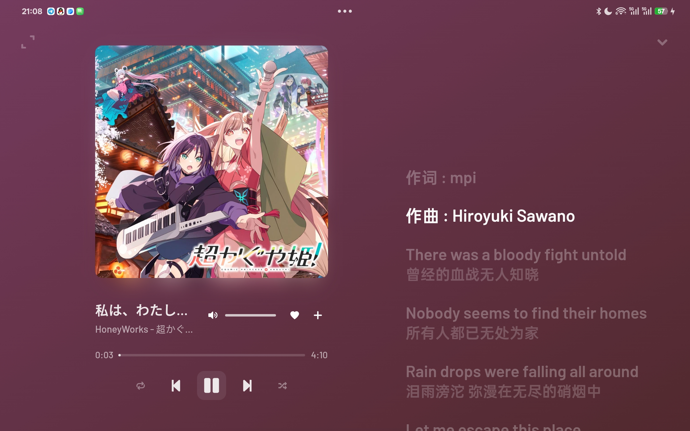
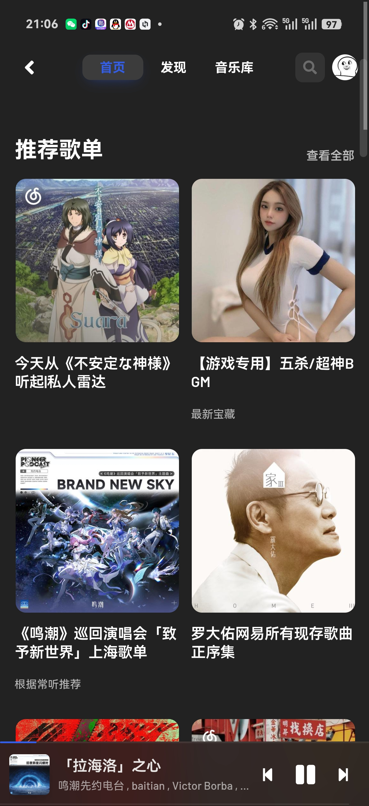
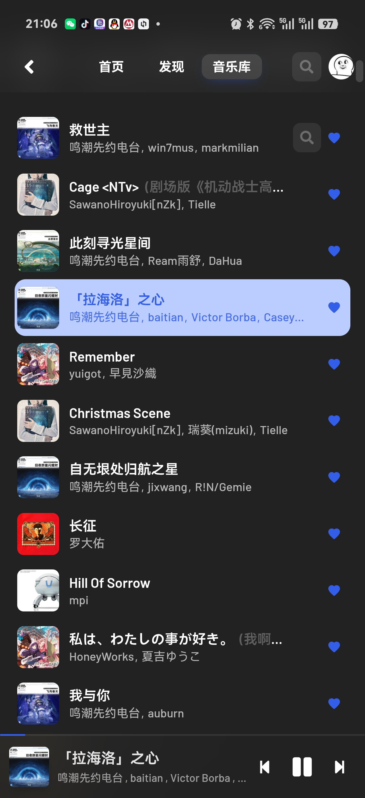
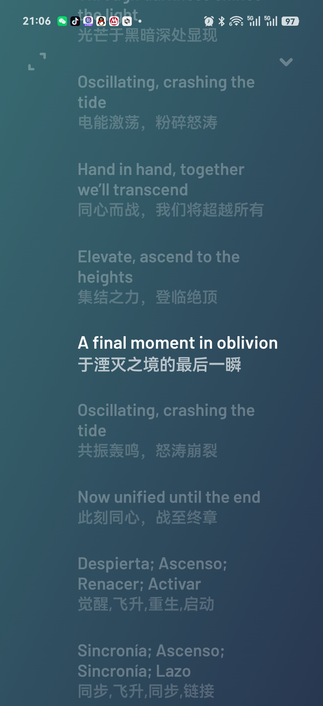
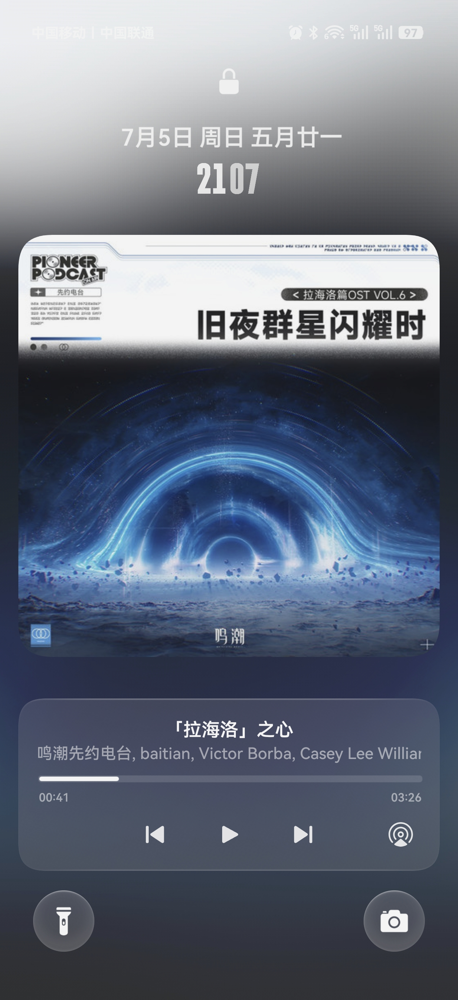

<p align="center">
  
</p>

<h1 align="center">YesPlayMusic for Android</h1>

<p align="center">
  为 Android 手机与平板重新适配的 YesPlayMusic 客户端，在尽量保留原版界面的同时，补齐原生播放与系统媒体控制体验。
</p>

<p align="center">
  
  
  
  
</p>

<p align="center">
  <a href="https://github.com/whdycdq/YesPlayMusicForAndroid/releases"><strong>下载 APK</strong></a>
  ·
  <a href="README_ANDROID.md"><strong>构建说明</strong></a>
  ·
  <a href="https://github.com/whdycdq/YesPlayMusicForAndroid/issues"><strong>反馈问题</strong></a>
</p>

## 项目简介

本项目基于 [qier222/YesPlayMusic](https://github.com/qier222/YesPlayMusic) 0.4.10 移植，通过 Capacitor 运行于 Android，并针对触屏交互、后台播放、系统媒体控件和不同屏幕尺寸进行了专门适配。

界面整体延续 YesPlayMusic 原有风格，同时支持手机竖屏和平板横屏布局。最低支持 Android 7.0（API 24），已适配 Android 16。

## Android 版特性

- **手机与平板自适应**：针对窄屏手机和横屏平板分别优化布局、字号、间距与播放页。
- **沉浸式界面**：适配状态栏、刘海/挖孔屏和底部手势区域，内容安全延伸到屏幕边缘。
- **原生后台播放**：使用 Android 前台媒体服务，切出应用或锁屏后继续播放。
- **完整系统媒体控制**：支持通知栏、锁屏、灵动岛类媒体控件及耳机按键的播放、暂停、上一首、下一首和进度调整。
- **网易云账号登录**：支持扫码登录和账号登录，并在应用内自动完成登录信息处理，无需手动填写 Cookie。
- **触屏手势导航**：首页、发现和音乐库可左右滑动切换，标签指示与页面动画同步。
- **更适合触屏的歌曲操作**：单击歌曲直接播放；长按打开完整菜单，进入歌手/专辑、收藏和歌单等操作集中于菜单中。
- **歌词与播放页**：支持滚动歌词、双语歌词、专辑封面背景以及手机/平板专属播放页布局。
- **深色与浅色模式**：跟随系统或手动选择主题。
- **Android 返回键**：支持系统返回手势与实体返回键。
- **可配置 API**：可在设置中更换 NeteaseCloudMusicApi 服务地址。

## 界面预览

### 平板横屏

<p align="center">
  
</p>

### 手机界面

<p align="center">
  
  
  
</p>

### 锁屏与系统媒体控件

<p align="center">
  
  
</p>

## 安装

1. 前往 [Releases](https://github.com/whdycdq/YesPlayMusicForAndroid/releases) 下载最新 APK。
2. 在 Android 设备上允许当前文件管理器或浏览器安装未知来源应用。
3. 安装后使用网易云音乐扫码登录，或在登录页面使用账号登录。

如果默认音乐服务不可用，可在“设置 → 网易云 API 服务地址”中填写自己部署的 NeteaseCloudMusicApi 地址。

## 本地构建

构建环境需要 Node.js 22 或更新版本、JDK 21，以及包含 Android API 36 的 Android SDK。

```bash
git clone https://github.com/whdycdq/YesPlayMusicForAndroid.git
cd YesPlayMusicForAndroid
npm install --legacy-peer-deps
npm run android:apk
```

调试 APK 输出位置：

```text
android/app/build/outputs/apk/debug/app-debug.apk
```

正式版签名、API 配置和发布构建方法请查看 [Android 构建说明](README_ANDROID.md)。

## API 与账号安全

APK 中配置的公共 API 仅用于匿名试用，可能出现限流或不可用。登录个人账号时，建议使用自己部署的 NeteaseCloudMusicApi 服务，避免将账号 Cookie 交给不受信任的第三方服务。

## 致谢

- 原项目：[qier222/YesPlayMusic](https://github.com/qier222/YesPlayMusic)
- 音乐 API：[Binaryify/NeteaseCloudMusicApi](https://github.com/Binaryify/NeteaseCloudMusicApi)
- Android 容器：[Capacitor](https://capacitorjs.com/)

## 开源许可

本项目基于 [MIT License](LICENSE) 开源，仅供个人学习与研究使用。请遵守网易云音乐服务条款以及所在地法律法规，禁止用于商业或非法用途。
